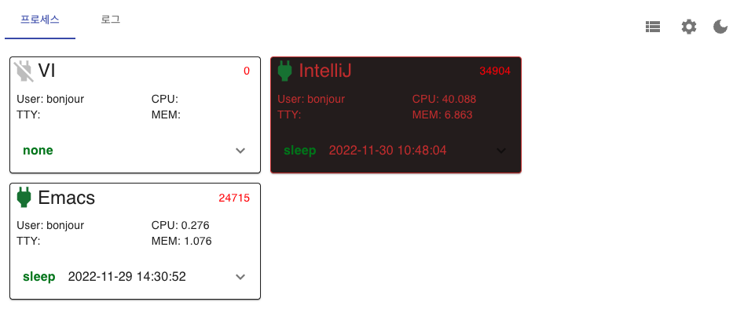
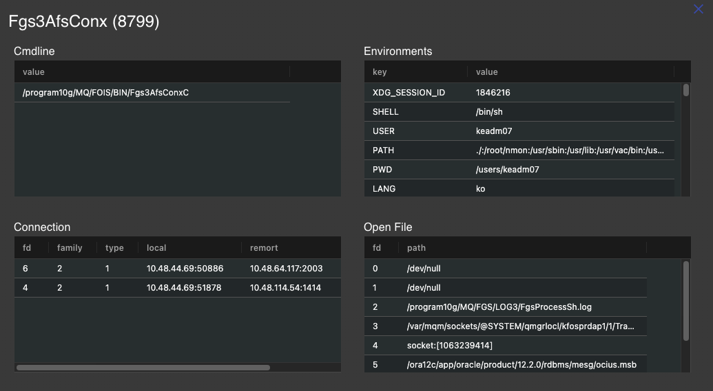
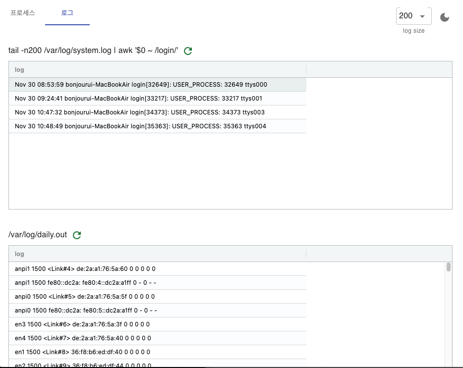

# PS-Monitor

## Skills
 - React
 - Go

## Features
 - dark theme
 - configable for process's list
 - adustable calling api's period

### config.yml

```yaml
server:
  port: 4900
  debug: true

program:
  match: 1
  ratioformat: "%.3f"
  processes:
    # label,command,user,color,bgColor
    - VI,nvim,bonjour,,
    - IntelliJ,idea,,#d53636de,#261e1e
    - Emacs,Emacs,,,

logs:
  - 0,tail -n%d /var/log/system.log | awk '$0 ~ /login/'
  - 1,/var/log/daily.out
```

## Screens

### Process View 



### Process Detail



### Log Viewer




## Run

download appropriate binary file from deploy directory  
when it lauches , it needs a config file (copy config.yml)  
